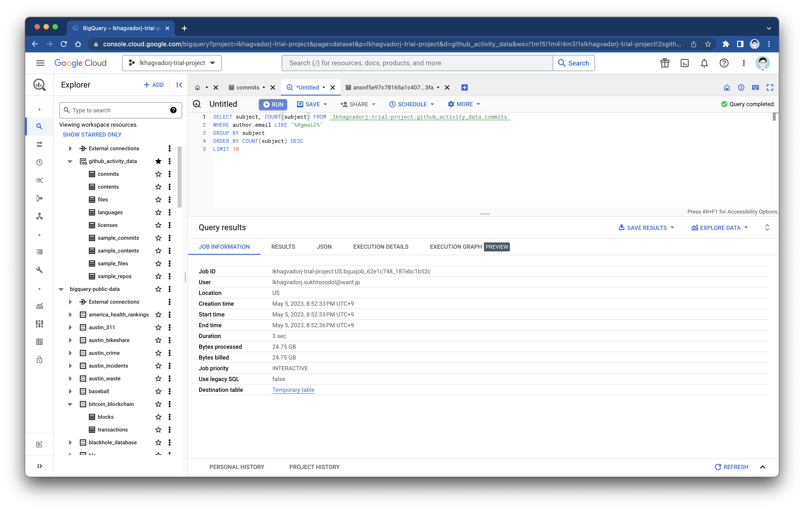

# クエリ結果のキャッシュと明示的なテーブル指定による永続化を利用する

DWHでは、クエリの結果はすべてテーブルとして結果が書き込まれます。テーブルには、以下の二種類があります。

- ***一時的なキャッシュ結果テーブル***：デフォルトで利用される方式。キャッシュとして保管される
- **宛先テーブル**：クエリの結果を明示的に指定したテーブルに書き込む。データを永続化することができる

# 一時的なキャッシュ結果テーブル

一時的なキャッシュ結果テーブルは、通常のデータベースでいうクエリキャッシュにあたります。**最大24時間まで保管**され、同じクエリが実行されると、原則としてキャッシュを利用して結果を返します。**同じクエリが実行**された場合には**キャッシュが利用され素早く結果**が返されるほか、**スキャン料金の対象外**です。

キャッシュはデフォルトで有効ですが、以下の場合利用できないです。

- CURRENT_TIMESTAMP()などの関数はクエリが一意に定まらないため、キャッシュを利用できな
- コンソールあるいはAPIで明示的に「キャッシュを利用しない」オプションを付与している場合
- クエリ対象テーブルがクエリ結果をキャッシュした後に変更されている場合

このキャッシュの実態は一時領域に保存されたテーブルであるため、再度ここにクエリを実行できます。非常に高速に読み出しができ、通常のクエリよりも高速に処理できます。



また、この一次テーブルは、スクリプトの中でも明示的に作成できます。例えば連続したクエリで一時テーブルを作成してデータマート化を行いたい場合も、キャッシュ結果テーブルは高速に動作するため便利なうえ、ストレージ料金がかかることもありません。

例：

一時テーブルを利用したデータマート生成のスクリプトの例です。売上の生レコードのテーブルである`sales_records` と顧客データ`customer_data`、商品マスタ `product_master`テーブルを結合し、データをJSONしただけの`joined_sales_records`を一時テーブルとして生成します。その後、一時テーブルから集計のためのクエリをかけて月次売上データマート`datamart_monthly`を作成しています。

```sql
CREATE TEMP TABLE joined_sales_record AS
SELECT
sales_records.*,
customer_data.name AS customer_name,
product_master.name AS product_name
FROM
sales_records
JOIN
customer_data
ON
sales_records.customer_id = customer_data.id
JOIN
product_master
ON
sales_records.product_id = product_master.id;`

`CREATE TABLE datamart_monthly AS
SELECT
DATE_TRUNC('month', date) AS month,
product_name,
SUM(revenue) AS revenue
FROM
joined_sales_record
GROUP BY
month,
product_name;
```

このように、スクリプトの一時テーブルを用いて、データマートの生成などの共通処理を行うことで、後で再利用します。

# 宛先テーブル

宛先テーブルは、クエリの結果を明示的にストレージの永続流領域に保存する機能です。SQL文で CREATE TABLE AS SELECT … とするか、クエリエディタから「クエリの設定」「後先テーブルの書き込み設定」で指定できます。宛先テーブルを選択すると、**クエリ結果はテーブルとしてDWHのストレージ上で永続化されます。**

DWHでは、IAMやACLを利用してテーブルやデータセットに対するアクセスさえ付与すれば、プロジェクトをまたいでテーブルを参照できます。

例：

マーケティング部門がデータサイエンス部門にマーケティング施策の分析を依頼し、考えている施策の対象ユーザをもらう例です。（基本的にDWHのプロジェクトが分かれている場合が多いでしょう）

1. マーケターがデータサイエンティストにデータの分析依頼
・CRMやアクセス解析ログのデータをコピーしなくても、読み取り権限をデータサイエンティストに与えることで、データサイエンティストはマーケティング部門が保持するデータにアクセスできるようになる
2. データサイエンティストが分析を行なった結果を出力
・データサイエンス部門で利用しているプロジェクト内部の実験用データセットに、分析クエリの結果を宛先テーブルを指定することで保存できる
3. データサイエンティストが結果をマーケターに共有する
・分析結果の対象ユーザセグメントリストのテーブルに、マーケターの読み取りアクセスを許可することで、データコピーなく結果が共有できる

さらに、このプロセスをマーケテングオートメーションの観点で自動化するために、プロジェクトをまたいで書き込みを許可することで、この結果を定常的に受け渡すこともできます。このように、この宛先テーブル機能は、完成したデータマートの別部署への受け渡しや、分析結果の共有などで利用すると良いでしょう。

DWHはストレージアーキテクチャによりストレージは共通しているため、権限の設定だけで、簡単に同じデータを共有できます。用途に応じてさらに厳密なセキュリティ設計ができます。このメリットはデータ活用の課題であるデータサイロの解消に大きく貢献します。パフォーマンスだけでなく、ETLパイプラインを少ないし、複数のDWH環境の管理による疲弊がなくなるのは、アーキテクチャ上の大きな特徴です。
